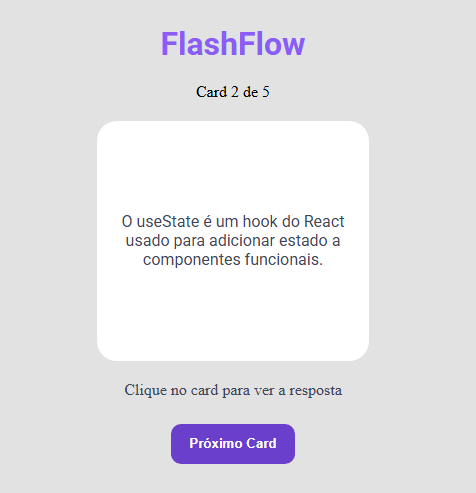

# 📚 Flashcards Interativos

### 📸 Preview 

Projeto de flashcards interativos desenvolvido com **HTML**, **CSS** e **JavaScript puro**, ideal para auxiliar nos estudos com perguntas e respostas dinâmicas. Basta clicar no card para revelar a resposta, e navegar entre as questões usando os botões disponíveis.

🔗 [Acesse o projeto publicado no GitHub Pages](https://adnilsonjr.github.io/FlashFlow/)

---

### ✨ Funcionalidades

- Exibição de uma **pergunta por vez**
- Clique no card para **revelar a resposta**
- Botão para ir ao **próximo card**
- Exibição da **posição atual** (ex: “2 de 5 cards”)
- Interface responsiva e leve, sem uso de frameworks

---

### 🚀 Tecnologias utilizadas

- **HTML5** — estrutura do projeto
- **CSS3** — estilização dos elementos
- **JavaScript** — lógica e interatividade

---

